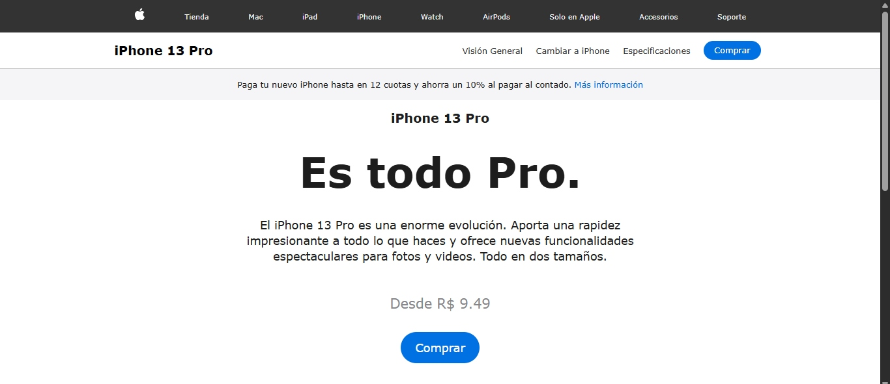

# Clone de Landing Page - iPhone 13 Pro

Este proyecto es un clon profesional y 100% responsivo de una Landing Page del Iphone 13 Pro. Fue construido con HTML, CSS y JavaScript puro, sin frameworks, con el objetivo de practicar estructura semántica, diseño visual moderno e interacciones dinámicas en frontend.

---

## Características principales

- Clon visual fiel a la estética Apple
- Interacción dinámica para cambiar el color del producto (selector de color)
- Diseño completamente responsivo
- Navegación fluida con menú estructurado
- SEO básico implementado con metaetiquetas y OpenGraph 
- Elementos accesibles con uso de `alt`, estructura semántica y `aria`

---

## Tecnologías utilizadas

- **HTML5** - estructura semántica y SEO básico
- **CSS3** - layout responsivo, diseño visual y media queries
- **JavaScript (ES6)** – interacción dinámica y manipulación del DOM
- **Meta Tags / Open Graph** – optimización para redes sociales y buscadores

---

## Vista previa

---

## Estructura del proyecto
Projeto.Clone.Iphone/
├── index.html
├── css/
│   └── styles.css
├── js/
│   └── scripts.js
├── img/
│   ├── iphone_green.jpg
│   ├── iphone_silver.jpg
│   ├── iphone_golden.jpg
│   ├── iphone_grafite.jpg
│   ├── iphone_blue.jpg
│   ├── logo_apple.svg
│   └── preview.jpg 
├── README.md   

---

## Licencia

Este proyecto fue desarrollado con fines educativos y de portafolio personal. Inspirado en el sitio oficial de Apple.
Todos los derechos de imagen y marca pertenecen a Apple Inc.

--- 

## Autora

GitHub: @amandaceereja
Contacto: amandacereja027@outlook.com